# AI-driven Customer Sales Analysis

This proof-of-concept demonstrates how AI models can analyze customer sales data and provide insights for business decision-making. The system uses function calling to access real customer and sales order data stored in a PostgreSQL database.

## Project Structure 🏛️
```
├── src/
│   ├── Athena.Api/              # ASP.NET Core API with SemanticKernel
│   │   ├── Database/            # Entity Framework Core entities and DbContext
│   │   ├── Extensions/          # Database seeding and configuration extensions  
│   │   ├── Plugins/             # SemanticKernel function plugins
│   │   └── Migrations/          # EF Core database migrations
│   └── Athena.AppHost/          # .NET Aspire orchestration host
│       └── ollama-startup.sh    # Ollama container initialization script
├── .vscode/                     # VS Code launch configurations
└── README.md                    # You are here 😉
```

## Building Blocks 🏢

**New Architecture Features:**
- **Universal Container Support**: Works seamlessly with both Docker and Podman
- **API Facade Pattern**: Athena API acts as a gateway/proxy for Ollama, providing OpenAI-compatible endpoints
- **Integrated Documentation**: Built-in Scalar API documentation for easy API exploration
- **Robust Initialization**: Enhanced container startup scripts with health checking and model caching

```mermaid
graph TD
    A[Open-WebUI<br/>Chat Interface] --> |OpenAI Compatible API<br/>HTTP/REST| B[Athena API<br/>ASP.NET Core + SemanticKernel]
    
    B --> |Entity Framework Core<br/>Npgsql<br/>Customer & Sales Entities<br/>EF Core Schema| C[(PostgreSQL Database<br/>Customers & Sales Orders)]
    
    B --> |OllamaApiFacade<br/>Proxy/Gateway<br/>OpenAI Compatible API| D[Ollama Container]
    
    D --> E[qwen3:1.7b Model<br/>• Small footprint<br/>• Function calling support<br/>• Good performance/size ratio]
    
    E --> |Function Call Responses<br/>JSON Schema| B
    
    B --> |SemanticKernel Plugin with Function Definitions<br/>GetCustomer, GetAllCustomers<br/>GetSalesForCustomer, GetAllSales| E
    
    A --> |Also supports direct<br/>API endpoints| B
    
    style A fill:#e1f5fe
    style B fill:#f3e5f5
    style C fill:#e8f5e8
    style D fill:#fff3e0
    style E fill:#ffebee
```



## Large Language Model 🧠

The LLM in use is `qwen3:1.7b` as it fully supports function calling and offers a good tradeoff between context size and performance.

## Container Compatibility 🐳

**Universal Container Runtime Support**: The application now works seamlessly with both Docker and Podman through improved Aspire endpoint management:
- **Docker**: Uses standard Docker networking
- **Podman**: Compatible with Podman's container networking
- **Aspire Integration**: Automatic service discovery and endpoint resolution

## API Architecture 🏗️

**Facade Pattern Implementation**: The Athena API serves dual purposes:
1. **Business Logic API**: Custom endpoints for customer and sales data with AI-powered analysis
2. **Ollama API Facade**: Acts as a proxy/gateway providing OpenAI-compatible endpoints
   - Open-WebUI connects through this facade instead of directly to Ollama
   - Enables seamless integration with any OpenAI-compatible client
   - Maintains consistent API patterns across the application

## Getting started 🚀

### Prerequisites
- .NET 9.0 SDK
- Docker or Podman
- VS Code (optional, but recommended)

### Quick Start
1. **Launch with VS Code**: Open the project and use `F5` to start debugging with the "Athena AppHost (HTTP)" configuration
   - The Aspire dashboard will automatically open in your browser
   - All services (PostgreSQL, Ollama, Open-WebUI) will be orchestrated automatically

2. **Or launch manually**:
   ```bash
   cd src/Athena.AppHost
   dotnet run --launch-profile http
   ```

3. **Wait for initialization**:
   - PostgreSQL database will be created and seeded with sample data
   - Ollama will automatically pull the `qwen3:1.7b` model (first run only)
   - Open-WebUI will be available at http://localhost:8181

4. **Start chatting**: Open http://localhost:8181 and ask questions like:
   - "Show me all customers"
   - "What sales orders does customer CUST-001 have?"
   - "Analyze the sales patterns for our top customers"

### Available Endpoints
- **Aspire Dashboard**: http://localhost:15230 (auto-opens with VS Code)
- **Open-WebUI**: http://localhost:8181 (connects through API facade)
- **API Documentation**: http://localhost:{api-port}/scalar (Scalar API docs)
- **API Endpoints**:
  - `GET /api/customers` - List all customers
  - `GET /api/customers/{customerId}` - Get specific customer
  - `GET /api/sales-orders` - List all sales orders
  - `GET /api/sales-orders/customer/{customerId}` - Get customer's orders
  - `POST /api/chat` - AI chat endpoint (SemanticKernel-powered)
- **Ollama API Facade**: Full OpenAI-compatible API proxy to Ollama
  - Accessible through the Athena API for seamless integration
  - Supports all standard OpenAI chat completion endpoints

### Entity Framework Migrations 🗄️

For Entity Framework design-time operations (migrations, database updates), you need to set the connection string as an environment variable:

```bash
# Set the connection string for EF migrations
export ConnectionStrings__postgres-default="Host=localhost;Database=athena;Username=postgres;Password=postgres"

# Then run EF commands
dotnet ef migrations add YourMigrationName
dotnet ef database update
```

The application uses Entity Framework Core with PostgreSQL to manage customer and sales order data.

## Sample Interactions 💬

### Customer Analysis
```
👤 User: "Show me all customers"
🤖 AI: Lists all customers with their details and provides insights

👤 User: "What can you tell me about customer CUST-001?"
🤖 AI: Provides customer details and their sales history

👤 User: "Which customer has the highest total order value?"
🤖 AI: Analyzes sales data and identifies top-performing customers
```

### Sales Pattern Analysis
```
👤 User: "Analyze the sales trends for the last month"
🤖 AI: Reviews recent sales orders and identifies patterns

👤 User: "What's the average order value across all customers?"
🤖 AI: Calculates and explains sales metrics with business insights
```

The AI assistant acts as a **sales analyst** providing data-driven insights and recommendations based on real customer and sales order data.

## Technology Stack 🛠️

- **.NET 9.0** - Application runtime
- **ASP.NET Core** - Web API framework with facade pattern
- **Entity Framework Core** - Data access layer
- **PostgreSQL** - Database with automatic seeding
- **SemanticKernel** - AI orchestration and function calling
- **Ollama** - Local LLM hosting (qwen3:1.7b model) with enhanced startup
- **OllamaApiFacade** - Excellent NuGet package by [Gregor Biswanger](https://github.com/GregorBiswanger) for OpenAI-compatible Ollama integration
- **.NET Aspire** - Cloud-ready orchestration with universal container support
- **Open-WebUI** - Chat interface (connects via API facade)
- **Scalar** - Interactive API documentation
- **Docker/Podman** - Container runtime (both supported)

## Acknowledgments 🙏

Special thanks to **Gregor Biswanger** for the fantastic [OllamaApiFacade](https://www.nuget.org/packages/OllamaApiFacade/) NuGet package, which provides seamless OpenAI-compatible API in ASP.NET Core services.
